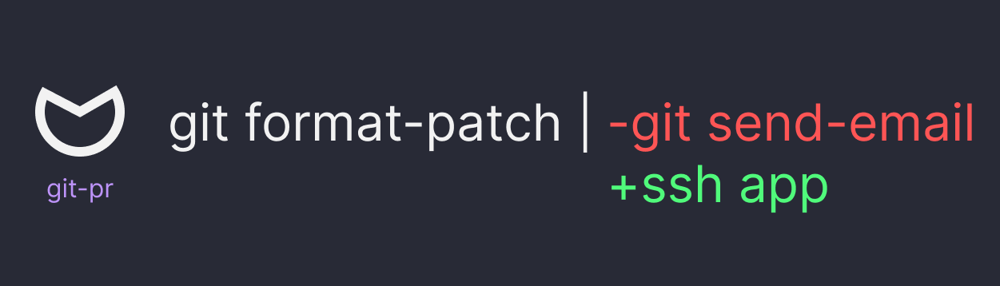

# `pico/git-pr` a self-hosted git collaboration server

We are trying to build the simplest git collaboration tool. The goal is to make
self-hosting a git server as simple as running an SSH server -- all without
sacrificing external collaborators time and energy.

> `git format-patch` isn't the problem and pull requests aren't the solution.

We are combining mailing list and pull request workflows. In order to build the
simplest collaboration tool, we needed something as simple as generating patches
but the ease-of-use of pull requests.

The goal is not to create another code forge here. The goal is to create a very
simple self-hosted git solution with the ability to collaborate with external
contributors. All the code owner needs to setup a running git server:

- A single golang binary

All an external contributor needs is:

- An SSH keypair
- An SSH client

# the problem

Email is great as a decentralized system to send and receive changes (patchsets)
to a git repo. However, onboarding a new user to a mailing list, properly
setting up their email client, and then finally submitting the code contribution
is enough to make many developers give up. Further, because we are leveraging
the email protocol for collaboration, we are limited by its feature-set. For
example, it is not possible to make edits to emails, everyone has a different
client, those clients have different limitations around plain text email and
downloading patches from it.

Github pull requests are easy to use, easy to edit, and easy to manage. The
downside is it forces the user to be inside their website to perform reviews.
For quick changes, this is great, but when you start reading code within a web
browser, there are quite a few downsides. At a certain point, it makes more
sense to review code inside your local development environment, IDE, etc. There
are tools and plugins that allow users to review PRs inside their IDE, but it
requires a herculean effort to make it usable.

Further, self-hosted solutions that mimic a pull request require a lot of
infrastructure in order to manage it. A database, a web site connected to git,
admin management, and services to manage it all. Another big point of friction:
before an external user submits a code change, they first need to create an
account and then login. This adds quite a bit of friction for a self-hosted
solution, not only for an external contributor, but also for the code owner who
has to provision the infra. Often times they also have to fork the repo within
the code forge before submitting a PR. Then they never make a contribution ever
again and a forked repo lingers. That seems silly.

# introducing patch requests (PR)

Instead, we want to create a self-hosted git "server" that can handle sending
and receiving patches without the cumbersome nature of setting up email or the
limitations imposed by the email protocol. Further, we want the primary workflow
to surround the local development environment. Github is bringing the IDE to the
browser in order to support their workflow, we want to flip that idea on its
head by making code reviews a first-class citizen inside your local development
environment. This has an interesting side-effect: the owner is placed in a more
collaborative role because they must create at least one patch to submit a
review. They are already in their local editor, they are already creating a git
commit and "pushing" it, so naturally it is easier to make code changes during
the review itself.

We see this as a hybrid between the github workflow of a pull request and
sending and receiving patches over email.

The basic idea is to leverage an SSH app to handle most of the interaction
between contributor and owner of a project. Everything can be done completely
within the terminal, in a way that is ergonomic and fully featured.

The web view is mostly for discovery.

Notifications would happen with RSS and all state mutations would result in the
generation of static web assets so the web views can be hosted using a simple
web file server.

## format-patch workflow

```bash
# Owner hosts repo `noice.git` using github

# Contributor clones repo
git clone git@github.com:picosh/test.git

# Contributor wants to make a change
# Contributor makes changes via commits
git add -A && git commit -m "fix: some bugs"

# Contributor runs:
git format-patch origin/main --stdout | ssh pr.pico.sh pr create noice
# > Patch Request has been created (ID: 1)

# Owner can checkout patch:
ssh pr.pico.sh pr print 1 | git am -3
# Owner can comment (IN CODE), commit, then send another format-patch
# on top of the PR:
git format-patch origin/main --stdout | ssh pr.pico.sh pr add --review 1
# UI clearly marks patch as a review

# Contributor can checkout reviews
ssh pr.pico.sh pr print 1 | git am -3

# Owner can reject a pr:
ssh pr.pico.sh pr close 1

# Owner can accept a pr:
ssh pr.pico.sh pr accept 1

# Owner can prep PR for upstream:
git rebase -i origin/main

# Then push to upstream
git push origin main

# Done!
```

The fundamental collaboration tool here is `format-patch`. Whether you a
submitting code changes or you are reviewing code changes, it all happens in
code. Both contributor and owner are simply creating new commits and generating
patches on top of each other. This obviates the need to have a web viewer where
the reviewer can "comment" on a line of code block. There's no need, apply the
contributor's patches, write comments or code changes, generate a new patch,
send the patch to the git server as a "review." This flow also works the exact
same if two users are collaborating on a set of changes.

This also solves the problem of sending multiple patchsets for the same code
change. There's a single, central Patch Request where all changes and
collaboration happens.

We could figure out a way to leverage `git notes` for reviews / comments, but
honestly, that solution feels brutal and outside the comfort level of most git
users. Just send reviews as code and write comments in the programming language
you are using. It's the job of the contributor to "address" those comments and
then remove them in subsequent patches. This is the forcing function to address
all comments: the patch won't be merged if there are comment unaddressed in
code; they cannot be ignored or else they will be upstreamed erroneously.

# roadmap

> [!IMPORTANT]\
> This project is being actively developed and we have not reached alpha status
> yet.

1. Publish demo video
1. Support user providing a config file
1. PR should be displayed as an event log
1. Guide for self-hosting `git-pr`
1. **Alpha status**
1. Git remote for repos
1. PR build steps (e.g. check that a patch can be cleanly applied)
1. Review patch inline (edit patch directly with comments `# xxx` then reupload)
1. TUI?
